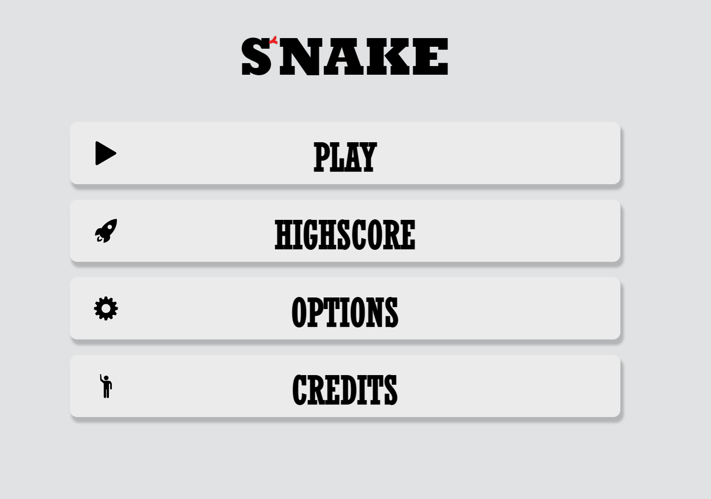

# Snake 
Dieses Projekt ist im Rahmen des Kurses Web-Programmierung im Wintersemester 2020/21
entstanden.

## Installation
Das Spiel wird als Modul in der canvas.html Seite inkludiert.

Aus diesem Grund funktioniert das Spiel __nicht__ wenn, die HTML-Seiten direkt im Browser aufgerufen werden. Es wird zum Spielen ein lokaler Webserver benötigt.
Für die Entwicklung habe ich hierfür einen Entwicklungswebserver der IDE WebStorm von JetBrains® verwendet. 
Hierfür habe ich eine neue _JavaScript Debug_ Konfiguration hinterlegt (Screenshot unterhalb.)

Generell sollte hier jedoch jeder handelsübliche WebServer funktionieren (bspw. xammp). Als Einstiegspunkt sollte die _main.html_ Seite gewählt werden. 

Weitere Abhänigkeiten bestehen nicht, da der Aufgabenstellung entsprechend keine Fremd-Libarys verwendet wurden.
## Spiel-Anleitung
Ist alles korrekt konfiguriert sollte beim Start der Applikation das Hauptmenü (_main.html_) erscheinen.

Das Spiel wird über den Menüpunkt __PLAY__ gestartet.
Gesteuert wird mit den Pfeiltasten. Die Schlange bewegt sich eigenständig vorwärts und nimmt innerhalb kurzer Zeit an Geschwindigkeit zu.
Sind die Wände angeschaltet darf die Schlange diese nicht berühren, da dies zu einem GameOver führt. Auf dem Spielfeld sind Punkte verteilt. 

Diese gilt es einzusammeln. Jeder eingesammelte Punkt addiert einen Punkt auf den Spielstand und sorgt dafür, dass die Schlange um ein Segment länger wird.
Berührt die Schlange eine Wand oder ihren eigenen Schwanz ist das Spiel verloren und der Spieler kann seinen Namen in das Formular eintragen.

Die besten 10 Spielergebnisse können unter dem Menüpunkt __HIGHSCORE__ eingesehen werden.

Im Menüpunkt __OPTIONS__ kann der Sound und die Wände aus und angeschaltet werden.

Unter __CREDITS__ lassen sich Informationen zum Projekt und den verwendeten Ressourcen finden.

## Repository Aufbau

Dieses Repository ist wie folgt aufgebaut:

```
project-root
│   README.md           <-- dieses Dokument
|
│   main.html           <-- HTML Seiten
|   canvas.html         <-|
|   credits.html        <-|
|   highscore.html      <-|   
|   options.html        <-|
|      
|   SnakeGame.uml       <-- Klassendiagramm der Applikation
|   UML_Snakegame.pdf   <-|   
│
└───SnakeGame
│   │   Game.js <-- Hauptklasse
│   │   main.js <-- Applikations Eintrittspunkt/Skript der in HTML Seite eingebunden wird
│   │
│   └───src <-- Spiel src. Code
│       └───GameEntities
│           │   ...
│       └───Sound
│           │   ...
│       └───lib
│           │   ...
│   
└───assets <-- alle verwendeten Assets
│   └───Fonts
│   └───Images
│   └───Sounds
│   
└───js <-- js für Browserinteraktion 
│   │   gamesound.js
│   │   highscore.js
│   │   options.js
│
└───css <-- Stylesheets
    │   ...
```
## Klassendiagramm __./SnakeGame/src__ 

## Entscheidungen

* Der Quellcode für das eigentlich Spiel liegt getrennt von anderem JS-Code in einem eigenen Verzeichnis um direkte
  Zugriffe auf HTML Seiten, das *document* oder *window* Object zu kapseln. Nur die Game.js Klasse greift als Eintsiegspunkt in die Applikation auf *document* und *window* zu.
* Die css transitions wurden __nicht__ selbst entwickelt sondern mithilfe der Webseite http://animista.net generiert, da
  es sich um keine fremd Bibliothek handelt und nur dem polish dient.
* Mit dem Tag der Abgabe habe ich dieses Repository auf *public* umgestellt. Dies hat den Vorteil, dass falls etwas in
  der gezippten Version nicht funktionieren sollte, auf dieses Repository zurückgegriffen werden kann. Außerdem
  funktionieren dann die verlinkten Logos in dieser Datei und diese Readme Datei ist einfacher zu lesen.
* Die Sprites für das Spiel wurden von mir handgezeichnet bevor der visuelle Stil im Rahmen der ersten ESA feststand.
  Die Sprites passen nicht mehr 100% zum spartanischen/cleanen Stil des Spieles. Durch den entstandenen Aufwand wäre es
  allerdings schade die Sprites wegzuschmeißen, daher verbleiben sie im Spiel.
* Die Schlange startet immer an der selben Stelle. Der zuwachs der Gewschwindigkeit ist rein Zeitgesteuert und wirkt sich nicht auf die Punkte vergabe aus. Die Schlange ist mit Absicht so Schnell das sie schwer zu kontrollieren ist und das Spiel nicht zu einfach wird. 

## Known-Issues
* Durch die feste Geschwindigkeit, in der von Step zu Step gegangen wird, ist es möglich mehrmals pro Step zu "lenken" was es möglich macht 
  (besonders zu Beginn des Spieles) denk Kopf der Schlange in das Segment hinter dem Kopf zu steuern was zu einem sofortigen GameOver führt.
  
* Aus dem selben Grund ist es möglich beim Spiel ohne Wände den Canvas zu verlassen und sobald der Kopf das Feld verlässt in eine andere Richtung zu verlassen. Damit ist es möglich das die Schlange das Spielfeld verlässt ohne auf der gegenüberliegenden Seite wieder zu erscheinen.

